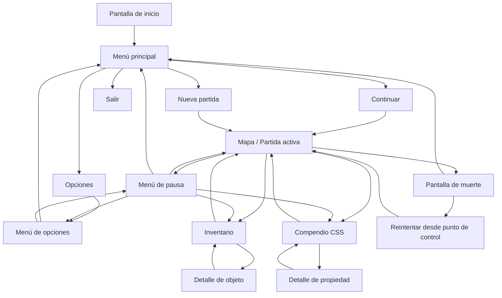
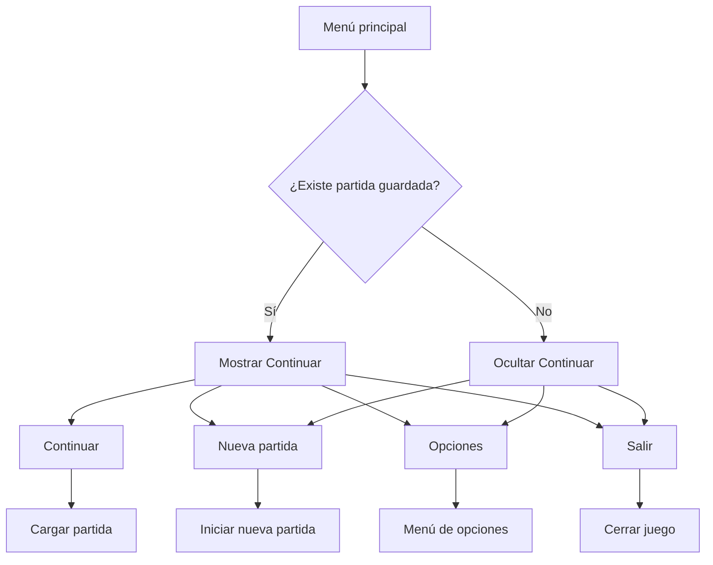
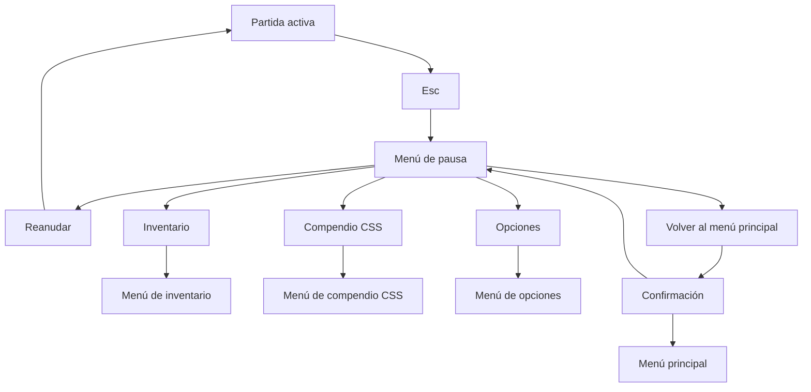
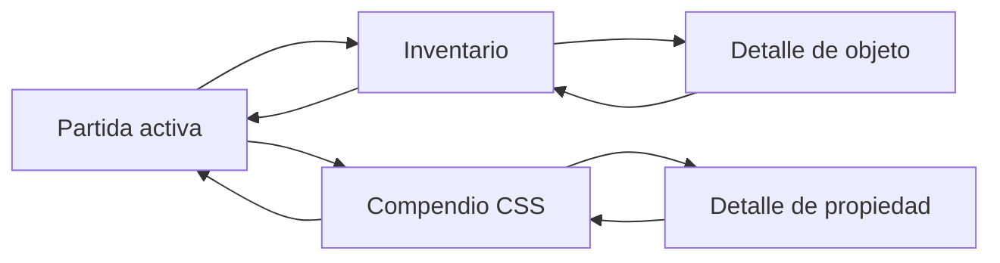

# Menús

La estructura de menús de _Citadel of Solar Souls (IA)_ debe ser clara, rápida y fácil de navegar. Su función no es solo dar acceso a opciones del sistema, sino también organizar la información del jugador, permitir la consulta de recursos importantes y acompañar el ritmo general de la experiencia sin romper la inmersión más de lo necesario. Cada menú debe tener un propósito concreto, una cantidad limitada de opciones y una navegación consistente con el resto del juego.

El sistema de menús se divide en dos grandes grupos: los menús de acceso general, como el menú principal, opciones o pausa, y los menús de consulta del jugador, como inventario y compendio de propiedades CSS. Todos deben compartir una lógica de uso coherente, con controles simples y transiciones comprensibles.

## Principios generales de usabilidad

- Cada menú debe cumplir una función específica y fácilmente entendible.
- La navegación entre menús debe requerir la menor cantidad posible de pasos.
- Las opciones principales deben estar visibles sin necesidad de profundizar demasiado.
- La estructura debe favorecer teclado y ratón como sistema principal de interacción.
- El jugador debe poder volver atrás con facilidad.
- Los menús de consulta no deben interrumpir innecesariamente la partida.
- Las transiciones deben sentirse limpias, rápidas y consistentes.

## Flujo general de menús

## Menú principal

### Nombre del menú

Menú principal

### Para qué sirve

Es el punto de entrada del juego. Permite iniciar una nueva partida, continuar una ya existente, acceder a las opciones generales o salir del juego.

### Qué debe mostrar

- Logotipo o nombre del juego
- Fondo visual representativo del mundo del juego
- Opciones principales de navegación
- Estado contextual según existencia o no de una partida guardada

### Qué opciones contiene

- **Continuar**  
  Solo aparece si existe una partida guardada válida.
- **Nueva partida**
- **Opciones**
- **Salir**

### Cómo se controla

- Ratón para seleccionar y hacer clic en opciones
- Teclado para navegar entre opciones
- Enter para confirmar
- Esc para regresar, si aplica

### Consideraciones

La opción principal debe cambiar dependiendo de si el jugador ya tiene una partida iniciada. Si no existe progreso guardado, la primera opción visible debe ser **Nueva partida**. Si sí existe, debe ser **Continuar**.

## Flujo del menú principal

## Menú de pausa

### Nombre del menú

Menú de pausa

### Para qué sirve

Permite detener temporalmente la partida y acceder a funciones de consulta o configuración sin abandonar el juego de forma abrupta.

### Qué debe mostrar

- Título de pausa o encabezado simple
- Opciones principales de navegación
- Fondo atenuado con la imagen congelada de la partida actual

### Qué opciones contiene

- **Reanudar**
- **Inventario**
- **Compendio CSS**
- **Opciones**
- **Volver al menú principal**

### Cómo se controla

- Esc para abrir y cerrar
- Ratón para seleccionar opciones
- Teclado para navegar
- Enter para confirmar
- Esc para cerrar si no se está dentro de un submenú

### Consideraciones

El menú de pausa debe ser rápido y no demasiado profundo. Su función principal es interrumpir el juego de forma segura y dar acceso a consulta o configuración inmediata.

## Flujo del menú de pausa

## Inventario

### Nombre del menú

Inventario

### Para qué sirve

Permite consultar los objetos importantes obtenidos durante la aventura. Su función es registrar hallazgos, mostrar descripciones y reforzar el lore del mundo y la progresión del jugador.

### Qué debe mostrar

- Lista de objetos obtenidos
- Nombre de cada objeto
- Icono o representación visual simple
- Objeto actualmente seleccionado
- Panel de descripción detallada

### Qué opciones contiene

- Lista navegable de objetos
- Área de descripción del objeto seleccionado
- Posible clasificación por tipo si el volumen de objetos crece en el futuro

### Cómo se controla

- Ratón para seleccionar objetos
- Flechas o WASD para moverse por la lista
- Enter o clic para enfocar un objeto
- Esc para salir
- Rueda del ratón si la lista requiere desplazamiento

### Consideraciones

El inventario no está pensado para consumir objetos ni gestionar recursos complejos. Su función es de consulta, narrativa y seguimiento de progreso. Debe sentirse más como una mochila de registro que como una pantalla de administración densa.

## Vista de detalle de objeto

### Nombre del menú

Detalle de objeto

### Para qué sirve

Permite leer información ampliada del objeto seleccionado en el inventario.

### Qué debe mostrar

- Nombre del objeto
- Ilustración o icono
- Descripción funcional
- Descripción narrativa o de lore
- Estado, si aplica, por ejemplo si está roto, incompleto o activo

### Qué opciones contiene

- Volver al inventario

### Cómo se controla

- Clic en el objeto para abrir
- Esc o botón de volver para cerrar

### Consideraciones

Cada objeto importante del juego debe tener una descripción breve pero significativa. Esta pantalla sirve para reforzar la sensación de mundo coherente y para conectar el progreso del jugador con elementos materiales del entorno.

## Compendio de propiedades CSS

### Nombre del menú

Compendio CSS

### Para qué sirve

Permite consultar todas las propiedades CSS desbloqueadas por el jugador, sus descripciones y su posible utilidad dentro del juego. Funciona como un almanaque de conocimiento acumulado y como apoyo estratégico.

### Qué debe mostrar

- Lista de propiedades desbloqueadas
- Estado de propiedades bloqueadas, si se decide mostrarlas
- Propiedad actualmente seleccionada
- Panel explicativo de su función
- Posible ejemplo breve de uso dentro del sistema de munición

### Qué opciones contiene

- Navegación por lista de propiedades
- Vista de detalle de cada propiedad
- Posible filtro por grupo o dificultad en fases posteriores del desarrollo

### Cómo se controla

- Tab o acceso desde menú de pausa
- Ratón para seleccionar propiedades
- Flechas o WASD para navegar
- Enter o clic para ver el detalle
- Esc para cerrar

### Consideraciones

Este compendio es una pieza muy importante de apoyo al aprendizaje. Debe ser claro, ordenado y útil tanto para recordar qué hace una propiedad como para ayudar al jugador a decidir qué tipo de munición construir.

## Vista de detalle de propiedad

### Nombre del menú

Detalle de propiedad CSS

### Para qué sirve

Permite leer una explicación más completa de una propiedad desbloqueada, su función general y su aplicación aproximada dentro del juego.

### Qué debe mostrar

- Nombre de la propiedad
- Descripción clara de lo que hace
- Posible ejemplo de sintaxis
- Posible pista de uso jugable
- Relación con enemigos, puzzles o exploración, si aplica

### Qué opciones contiene

- Volver al compendio

### Cómo se controla

- Clic o Enter sobre la propiedad
- Esc para volver

### Consideraciones

La explicación no debe sentirse como una documentación técnica pesada. Debe ser lo suficientemente clara para enseñar, pero lo suficientemente breve para no romper el ritmo de la experiencia.

## Menú de opciones

### Nombre del menú

Opciones

### Para qué sirve

Permite modificar configuraciones generales del juego relacionadas con experiencia de usuario, accesibilidad, audio y controles.

### Qué debe mostrar

- Categorías de configuración
- Ajustes disponibles
- Estado actual de cada ajuste

### Qué opciones contiene

- **Audio**
  - Volumen general
  - Volumen de música
  - Volumen de efectos
- **Controles**
  - Mostrar esquema de control
  - Posible remapeo en versiones posteriores
- **Accesibilidad**
  - Activar o desactivar fijado de enemigo
  - Activar o desactivar ayudas de apuntado
  - Ajustes futuros de legibilidad o ayudas visuales
- **Video**
  - Pantalla completa
  - Resolución, si aplica
- **Idioma**
  - Selección de idioma disponible

### Cómo se controla

- Ratón para cambiar valores
- Flechas o WASD para navegar
- Enter para confirmar
- Esc para volver

### Consideraciones

Las opciones deben estar disponibles tanto desde el menú principal como desde el menú de pausa. Esto evita obligar al jugador a salir de su partida para ajustar un aspecto del juego.

## Pantalla de muerte

### Nombre del menú

Pantalla de muerte

### Para qué sirve

Gestiona el estado posterior a la derrota del jugador y ofrece una salida clara para volver a la acción o abandonar la sesión actual.

### Qué debe mostrar

- Mensaje de derrota
- Fondo atenuado o representativo del estado de caída
- Opciones de reintento o salida

### Qué opciones contiene

- **Reintentar desde último punto de control**
- **Volver al menú principal**

### Cómo se controla

- Ratón para seleccionar
- Teclado para navegar
- Enter para confirmar

### Consideraciones

La pantalla de muerte debe ser rápida y no castigar con exceso de pasos. El objetivo es devolver al jugador al loop principal sin fricción innecesaria.

## Flujo de consulta del jugador

Además del flujo principal de arranque y pausa, existe un flujo de consulta constante que conecta la partida con menús de información del jugador.

## Relación entre menús y usabilidad

El sistema de menús debe apoyar tres necesidades principales del jugador:

1. **Entrar y salir del juego con facilidad**  
   Esto depende del menú principal, la pantalla de muerte y el menú de pausa.

2. **Consultar información importante sin perderse**  
   Esto depende del inventario, el compendio CSS y sus vistas de detalle.

3. **Modificar la experiencia sin fricción**  
   Esto depende del menú de opciones y de su acceso desde múltiples puntos.

## Principio general del sistema de menús

Los menús de _Citadel of Solar Souls (IA)_ deben ser funcionales, limpios y coherentes con el resto del diseño del juego. No deben sentirse como un sistema ajeno, sino como una extensión ordenada de la experiencia. Su estructura debe ayudar al jugador a orientarse, consultar, ajustar y volver al juego rápidamente, reforzando en todo momento la claridad, la accesibilidad y la sensación de control.
