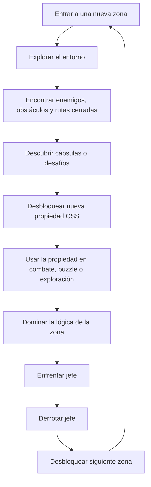

El game loop principal de _Citadel of Solar Souls (CSS)_ se basa en una estructura de progreso por zonas donde el jugador explora, aprende, aplica y supera una prueba final. Cada área del juego introduce nuevos enemigos, nuevos obstáculos y nuevos conceptos de CSS que deben ser descubiertos y dominados para poder avanzar. El objetivo de este loop es que la progresión del jugador no dependa únicamente de su habilidad motriz, sino también de su comprensión del sistema central del juego.

La secuencia base consiste en entrar a una zona, explorarla, encontrar desafíos asociados a propiedades de CSS, desbloquear esas propiedades y utilizarlas en situaciones reales dentro del mapa. Estas situaciones pueden tomar la forma de combate, puzzles, rutas bloqueadas o mecanismos del entorno. A medida que el jugador domina las herramientas de esa región, se aproxima al jefe final del área, el cual funciona como una prueba integradora de lo aprendido. Al derrotarlo, se abre una nueva parte del mapa y el ciclo vuelve a comenzar con nuevos elementos.

Este loop debe sentirse constante, claro y satisfactorio. El jugador siempre debe percibir que explora para descubrir, descubre para aprender, aprende para aplicar y aplica para superar.

## Estructura general del loop

## Fases del game loop
### Exploración

El jugador entra a una nueva región y comienza a reconocer su estructura, sus riesgos y sus posibles caminos. Esta fase presenta el contexto visual, narrativo y jugable de la zona.

### Descubrimiento

Durante la exploración, el jugador encuentra desafíos, puntos de interés o cápsulas de prueba donde se introduce una nueva propiedad de CSS o una nueva aplicación de una propiedad ya conocida.

### Adquisición

Al superar el desafío correspondiente, el jugador obtiene una nueva propiedad o una nueva capacidad práctica dentro del sistema de munición y del mundo.

### Aplicación

La propiedad recién adquirida se utiliza inmediatamente en el entorno. Esta fase es crucial, ya que evita que el aprendizaje se sienta abstracto o despegado de la experiencia.

### Dominio

A medida que el jugador usa la propiedad en distintas situaciones, deja de verla como una novedad y empieza a integrarla dentro de su repertorio táctico y exploratorio.

### Evaluación

El jefe de la zona actúa como una prueba final. Su diseño debe exigir que el jugador use, entienda o al menos reconozca las herramientas y conceptos introducidos en ese tramo.

### Expansión

Al completar la zona, el jugador accede a una nueva área del mapa, lo que reinicia el loop en un nivel de complejidad superior o con nuevas variaciones.

