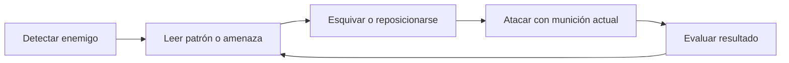
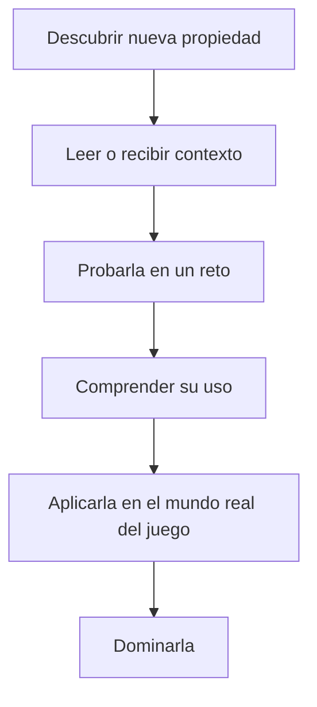
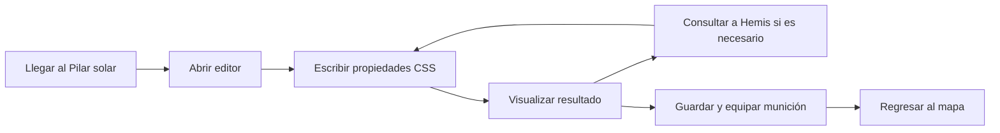
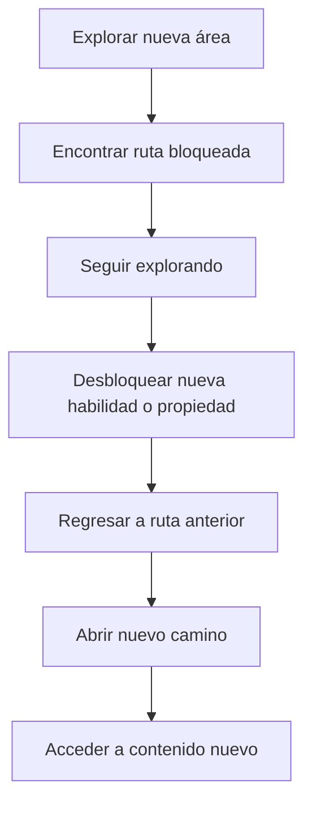
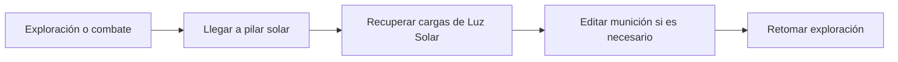

Además del loop principal de progresión por zonas, _Citadel of Solar Souls (CSS)_ se sostiene sobre varios ciclos secundarios que operan de forma constante durante la partida. Estos loops son más cortos, más específicos y están ligados a aspectos concretos de la experiencia, como el combate, el aprendizaje, la edición de munición o la exploración metroidvania.

Cada uno de estos loops refuerza una dimensión distinta del juego, pero todos deben mantenerse conectados con la lógica central del proyecto: aprender jugando y jugar aprendiendo.

## Loop de combate

El combate se basa en observar, esquivar, reposicionarse, disparar y volver a leer la situación. El jugador no debe depender de intercambios estáticos de daño, sino de movilidad, adaptación y uso correcto de la munición disponible.

Este loop debe sentirse ágil y justo. El jugador aprende de cada enfrentamiento, reconoce patrones y mejora su uso del movimiento y del disparo.

## Loop de aprendizaje

El aprendizaje en el juego sigue un ciclo práctico. El jugador descubre una propiedad, entiende para qué sirve, la prueba dentro del sistema y termina integrándola como parte de su conocimiento funcional.

Este loop convierte cada nuevo concepto de CSS en una herramienta viva y no en información memorizada sin contexto.

## Loop de edición de munición

La creación de balas personalizadas es uno de los núcleos del juego. Este loop ocurre cuando el jugador llega a un Pilar solar y decide preparar o ajustar su munición antes de volver al mapa.

Este loop debe ser breve, claro y funcional, de forma que editar munición se sienta como una extensión natural de la preparación táctica.

## Loop de exploración

La exploración sigue una estructura típica de descubrimiento, bloqueo y regreso con nuevas herramientas. Esto acerca al juego a una lógica de metroidvania simplificada.

Este loop hace que el mapa se sienta conectado y que las habilidades adquiridas tengan una utilidad espacial real.

## Loop de descanso y recuperación

Los pilares solares cumplen una función de respiro, preparación y reinicio parcial de recursos. El jugador llega a ellos después de superar una serie de riesgos y los utiliza para reorganizarse antes de volver al peligro.

