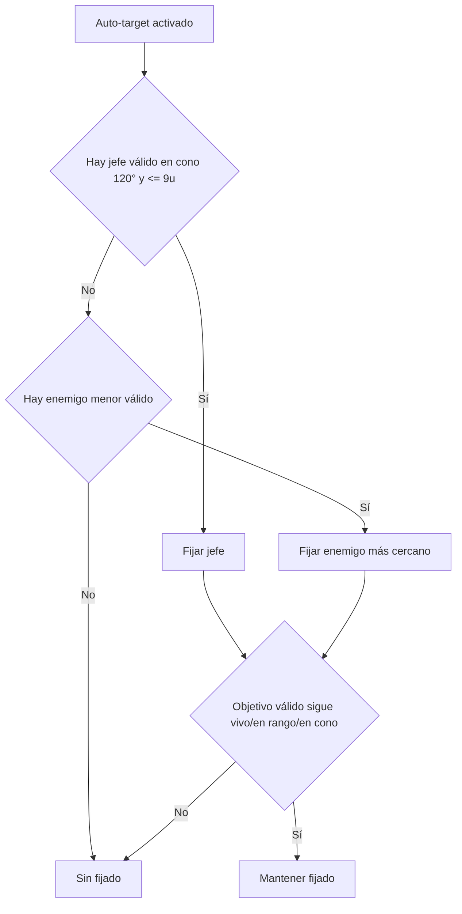

## Alcance

El **auto-target** es una asistencia de accesibilidad. Solo opera cuando está activado en el menú correspondiente.

## Reglas operativas (provisionales)

1. Solo funciona si la opción **Auto-target** está activada.
2. Prioriza al enemigo más cercano dentro de un **cono frontal de 120°**.
3. Distancia máxima de fijado: **9 unidades**.
4. Si el objetivo muere, sale del cono o supera distancia máxima, la fijación se cancela.
5. Un **jefe** tiene prioridad sobre enemigos menores si ambos están en rango válido.
6. El jugador puede fijar/liberar objetivo manualmente.
7. El apuntado manual arriba/abajo/diagonal prevalece sobre el auto-target.

## Orden de evaluación (provisional)

## Interacción con control manual

- Cuando el jugador aplica entrada direccional manual de disparo (arriba/abajo/diagonal), esa entrada tiene prioridad.
- Al soltar la entrada manual, el sistema puede retomar auto-target si sigue activo y encuentra objetivo válido.

## Criterios de QA (provisionales)

- Cambio de objetivo en menos de **150 ms** tras muerte del objetivo fijado.
- Cancelación de fijado inmediata al salir de cono o distancia.
- Sin cambios de objetivo “erráticos” cuando hay un solo candidato válido.
