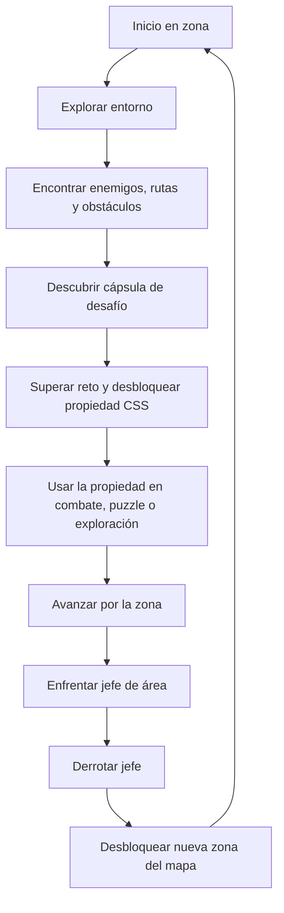
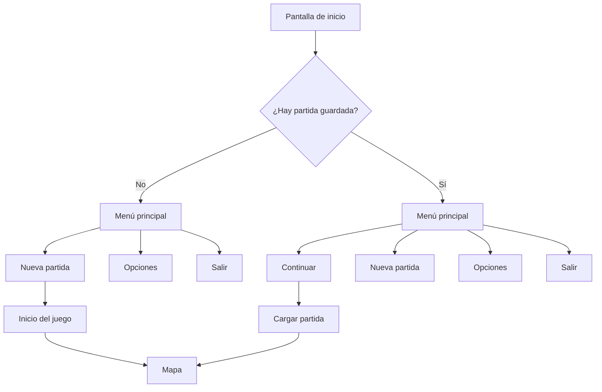
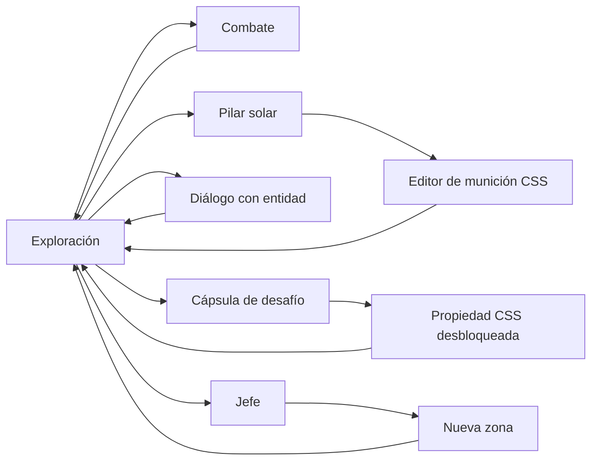

El flujo principal de _Citadel of Solar Souls (CSS)_ se basa en una progresión por zonas. El jugador explora una parte del mapa, descubre rutas, enemigos y puntos de interés, encuentra cápsulas de desafío donde desbloquea nuevas propiedades de CSS y utiliza esas nuevas herramientas para superar tanto los obstáculos de la zona como a sus enemigos. Al final de cada área se enfrenta a un jefe, diseñado como una prueba integradora de las mecánicas y propiedades aprendidas durante ese tramo. Una vez derrotado, se desbloquea el acceso a una nueva parte del mapa y el ciclo se repite con nuevos retos, enemigos y conceptos.

Este flujo busca que cada zona funcione como un bloque de aprendizaje y dominio. El jugador primero descubre, luego comprende, después practica y finalmente demuestra lo aprendido en un enfrentamiento mayor. De esta manera, la progresión del juego mantiene coherencia entre exploración, combate, puzzles y aprendizaje de CSS.

## Flujo general de progresión

## Estructura de progresión por zona

Cada zona del juego sigue una estructura reconocible que permite al jugador entender la lógica de avance sin perder la sensación de descubrimiento. Primero se le presenta una nueva región con su propio ambiente, enemigos y obstáculos. Después encuentra uno o varios desafíos donde desbloquea propiedades de CSS vinculadas a la lógica de esa zona. Una vez obtenidas, debe aplicarlas en situaciones reales dentro del mapa, ya sea para resolver puzzles, abrir rutas, modificar su munición o enfrentar enemigos con nuevas estrategias. Finalmente, culmina el área enfrentando a un jefe diseñado como una prueba de dominio de los conceptos introducidos en esa sección.

En términos de diseño, este flujo garantiza que el jugador no solo reciba nuevas herramientas, sino que tenga espacio para comprenderlas, practicarlas y demostrar que las domina antes de pasar al siguiente bloque del juego.

## Flujo de menús

El menú principal del juego es simple y directo. Si el jugador no cuenta con una partida guardada, la opción principal disponible será Nueva partida, acompañada de Opciones y Salir. Si ya existe una partida previa, entonces aparecerá también la opción Continuar, colocada como entrada principal del menú. La intención es que el acceso al juego sea claro, rápido y sin capas innecesarias de navegación.

## Transiciones principales durante la partida

Durante la partida, el jugador alterna entre diferentes estados de interacción que forman el ritmo general del juego. La mayor parte del tiempo se encontrará explorando y combatiendo, pero también podrá acceder a Pilares solares para editar su munición, entrar en cápsulas de desafío para desbloquear propiedades, interactuar con entidades mediante diálogos y enfrentarse a jefes al final de cada zona. Estas transiciones deben sentirse naturales y rápidas, evitando romper el ritmo de exploración y aprendizaje.

## Relación entre flujo y aprendizaje

El flujo del juego no solo organiza la progresión del mapa, sino también la progresión del aprendizaje. Cada zona introduce un pequeño conjunto de conceptos que el jugador primero descubre en un contexto controlado, después aplica en situaciones reales y finalmente domina en un enfrentamiento mayor. Esto hace que el aprendizaje no se sienta separado del juego, sino completamente integrado en él.

La estructura de explorar, desbloquear, aplicar y superar permite que cada nuevo contenido tenga una función clara dentro de la experiencia. El jugador no acumula propiedades de CSS solo por colección, sino porque cada una representa una herramienta práctica que modifica la forma en la que interactúa con el mundo.

## Principio general del flujo

El flujo de Citadel of Solar Souls (CSS) debe transmitir una sensación constante de avance. El jugador explora, descubre, aprende, aplica y vence. No se busca una experiencia fragmentada en pantallas aisladas, sino una progresión orgánica donde las transiciones entre menús, mapa, desafíos, combate y jefes mantengan coherencia tanto narrativa como jugable. Cada nueva zona debe sentirse como una extensión natural del viaje, y cada cierre de área como una confirmación de que el jugador ha dominado un nuevo bloque de conocimiento y acción.

